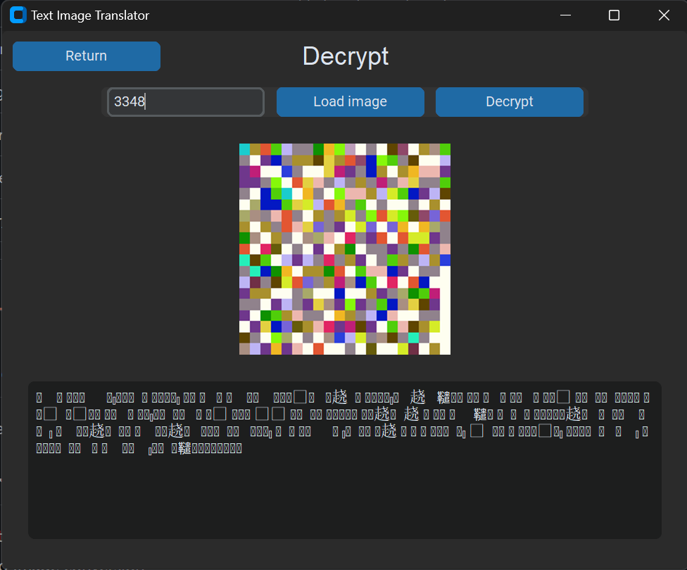

# Text and File Image Translator

Encrypt text/files into images and decrypt them back using custom seeds.

## Features
- Text to Image conversion
- File to Image conversion
- Seed-based encryption
- GUI and CLI interfaces

## Installation
```bash
git clone https://github.com/TheStrgamer/Text-as-image.git
cd Text-as-image
pip install -r requirements.txt
```

## Usage

### GUI
```bash
py TranslatorInterface.py
``` 

### CLI 
```bash
# Text
## Encrypt
python Text_Image_Translator.py encrypt "text" output.png [seed]

## Decrypt 
python Text_Image_Translator.py decrypt input.png [seed]

# File
# Encrypt
python File_Image_Translator.py encrypt input.file output.png [seed]

# Decrypt
python File_Image_Translator.py decrypt input.png output.file [seed]
```

## Some images of usage

### File encrypted using seed 3349


### The main menu of the GUI


### The page for encrypting text


### The page for decrypting text


### The result of decrypting with incorrect seed


### The page for encrypting a file


### The page for decrypting a file


